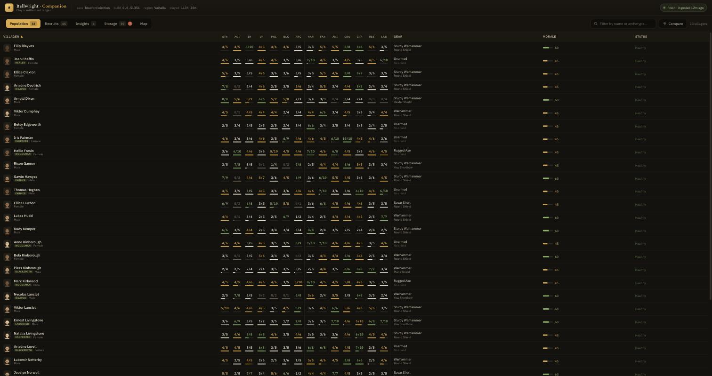
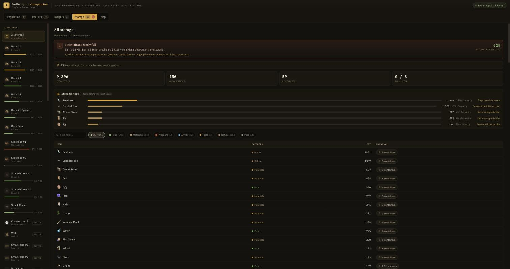
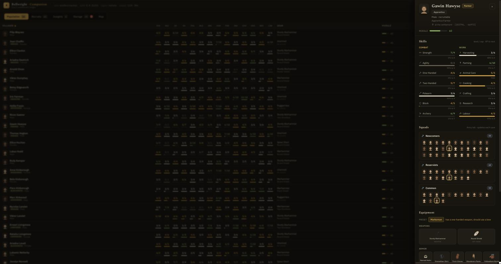

# Bellwright Companion

A self-hosted companion app for [Bellwright](https://store.steampowered.com/app/1812450/Bellwright/).
It parses the game's save files into a live web dashboard for your settlement —
check your villagers, squads, and storage from any browser, even while the
game is running.

**Read-only by design: this project never writes to save files.**

> ⚠️ **Beta** — versioned `0.0.x`. The save-format decoding is
> reverse-engineered and may break when the game updates; expect rough edges
> and breaking changes between releases. All GitHub releases are marked
> pre-release until a stable `0.1.0`.



<p align="center">
  
  
</p>

## What you get

- **Population roster** — every villager with skills (level/cap + XP progress),
  equipment, morale, and injuries with live heal countdowns
- **Recruits browser** — every recruitable NPC in the world with tier,
  profession, stats, and home village
- **Squads** — your Army-tab groups with full member rosters
- **Storage census** — every container with capacity fill bars, custom barn
  names, category filters, and "storage hogs" analysis
- **Insights** — automated triage: who's injured, unarmed, wrong loadout,
  under-prioritised, or about to level
- **Map** — the game's world map with your villagers, buildings, bandit camps,
  wildlife spawns, and community-mapped resources as filterable layers, plus a
  radius planner for placing work camps
- **Live updates** — a small watcher on your gaming machine ships every save
  automatically; the page refreshes itself when new data lands
- **Portraits** — generated avatars from each NPC's appearance data, or drop
  in real screenshots (see below)

## How it works

```
Gaming machine                         Your server (Docker/k8s/NAS)
┌─────────────────────────┐            ┌─────────────────────────────┐
│ Bellwright              │            │ bellwright-companion        │
│  └─ save .sav ──────────┼── ship ───▶│  VSWB → Oodle → protobuf    │
│ bellwright-publisher    │            │  → world state (SQLite)     │
│ (watch mode)            │            │  → web UI + API             │
└─────────────────────────┘            └─────────────────────────────┘
```

Bellwright saves are a custom `VSWB` container wrapping an Oodle-compressed
custom-protobuf world blob (~15 MB). The container/compression layer was
reverse-engineered by
[bellwright-gold-editor](https://github.com/BradMoeller/bellwright-gold-editor)
(MIT) — this project builds on its `SaveFile` loader and maps the *inner*
protobuf: see [docs/save-format.md](docs/save-format.md) for everything decoded
so far (NPCs, skills, equipment, injuries, squads, storage, appearance, …).

## Quickstart

### 1. Run the server (anywhere with Docker)

```sh
docker run -d -p 8710:8710 -v bellwright-data:/data \
  ghcr.io/claygorman/bellwright-companion:latest
```

Open `http://<server>:8710` — it will tell you it's waiting for a save.

### 2. Ship your saves (on the gaming machine)

Download `bellwright-publisher` for your platform from
[Releases](../../releases) (self-contained, no runtime needed), then:

```sh
bellwright-publisher watch --url http://<server>:8710/api/ingest
```

It auto-detects your save folder (Windows, Linux/Proton incl. secondary Steam
libraries, Flatpak Steam), pushes the newest save immediately, and keeps
pushing every time you save. One-shot mode: `bellwright-publisher push`.

That's the whole setup.

### From source

Prereqs: Node 24+, pnpm 9, Rust toolchain.

```sh
pnpm install
cargo build --release --manifest-path tools/dump/Cargo.toml
cp web/.env.example web/.env.local
pnpm build && pnpm start          # http://localhost:8710
curl -X POST --data-binary @YourChar_auto.sav http://localhost:8710/api/ingest
```

## Configuration

All configuration is via environment variables (and CLI flags on the publisher).

**Server** (see `web/.env.example`):

| Variable | Default | Purpose |
|---|---|---|
| `DATABASE_URL` | `file:./.data/bellwright.db` | SQLite path (`file:...`); a `postgres://` dialect is planned |
| `DATA_DIR` | `./.data` | Ingest scratch files + default DB location |
| `DUMP_BIN` | `../tools/dump/target/release/dump` | Save decompressor path (preset in Docker) |
| `SNAPSHOT_KEEP` | unset (keep all) | Retention: prune to the newest N snapshots |
| `KITS_FILE` | `$DATA_DIR/kits.json` | Optional gear-reserve targets (see below) |
| `PORT` / `HOSTNAME` | `8710` / `0.0.0.0` in Docker | Server bind |

**Gear reserves** (`kits.json`, optional): weapons and shields break, so the
Insights tab's craft list can plan flat spare counts on top of what your gear
presets demand. Drop a `kits.json` next to the database (or point `KITS_FILE`
at one):

```json
{ "reserves": { "Warhammer_C": 2, "RoundShield_C": 4, "StrengthenShirt_C": 2 } }
```

Keys are item classes as shown in the save (`web/kits.example.json` has a
starter); counts are extra copies to keep in storage beyond assigned gear.

**Publisher** (flags override env vars; `--help` for details):

| Flag | Env | Default | Purpose |
|---|---|---|---|
| `--url` | `BW_INGEST_URL` | `http://localhost:8710/api/ingest` | Ingest endpoint |
| `--dir` | `BW_SAVE_DIR` | auto-detected | Save folder |
| `--glob` | `BW_SAVE_GLOB` | newest `*.sav` | Exact filename instead |
| `--debounce` | `BW_DEBOUNCE_MS` | `15000` | Watch debounce (saves write in bursts) |

## Portraits & item icons (optional)

- **Item/building icons**: a common set ships in `web/public/icons/bw/`
  (fetched from the [Bellwright wiki](https://bellwright.fandom.com); these
  images are Bellwright game assets © Donkey Crew, hosted by the wiki — they
  are NOT covered by this repo's MIT license). If your save references items
  the set is missing, `pnpm icons` fetches the gaps; anything unresolved falls
  back to built-in line icons.
- **Real NPC portraits**: faces are procedural in-engine (no image exists in
  the save), so the UI generates avatars from each NPC's stored appearance
  data. For the real thing, screenshot each villager's character panel, run
  `python3 tools/portrait-cropper.py`, and drop the named crops into
  `web/public/portraits/<name-slug>.png` — the UI prefers them per villager.
  Portraits are per-player data and gitignored.

## Roadmap

- [x] Save decode: NPCs (skills, XP, equipment, morale, injuries + heal timers)
- [x] Squads (Army-tab groups with members)
- [x] Storage census with capacities and custom building names
- [x] Insights triage, live page refresh, injury countdowns
- [x] Generated avatars from appearance data + real-portrait pipeline
- [x] Self-contained publisher binaries (Linux/Windows/macOS)
- [x] Trends tab: storage/morale/XP history, production rates, runway forecasts
- [x] Gear presets decoded (custom preset names, ranked slot preferences,
      per-villager assignments) + craft list with `kits.json` reserves
- [x] Recruit filters (village, specialty, worker/fighter/balanced)
- [x] My-character tab (player pawn: skills, equipment, carried inventory)
      + Population "Gear & inventory" view
- [x] Real map imagery with calibrated save-coordinate projection, 24 filter
      layers (save-sourced + community wiki data, provenance-labeled), and a
      draggable radius placement planner (`pnpm map` fetches the imagery)
- [x] Tailwind v4 theme tokens across the UI (design-system handoff)
- [ ] Ingest auth token (shared secret) for internet-exposed servers
- [ ] Postgres backend behind `DATABASE_URL`
- [ ] Game-pak extraction (CUE4Parse): verified building radii, first-party
      icons, full resource-node tables, recipes
- [ ] Undecoded save fields: reservist/hold-ground toggles, housing/bed
      assignment, squad raised-state, village liberation status
- [ ] MCP server so AI assistants can query your settlement

## Contributing

See [CONTRIBUTING.md](CONTRIBUTING.md) — dev setup, architecture map, the
save-format research workflow, and PR expectations. Parser coverage (new
record types), the map, and Postgres support are great places to start.

## AI disclosure

This project was built in an AI pair-programming workflow with
**Claude (Anthropic)**: the save-format reverse-engineering, application code,
tooling, and documentation are substantially AI-authored, with human
direction, in-game verification, and testing throughout. Treat the code
accordingly — issues and corrections welcome.

## Disclaimer & license

Not affiliated with Donkey Crew or Bellwright. Reads save files only; never
modifies game data. Wiki-fetched icons and your own screenshots stay on your
machine and are not part of this repository.

MIT — see [LICENSE](LICENSE).
